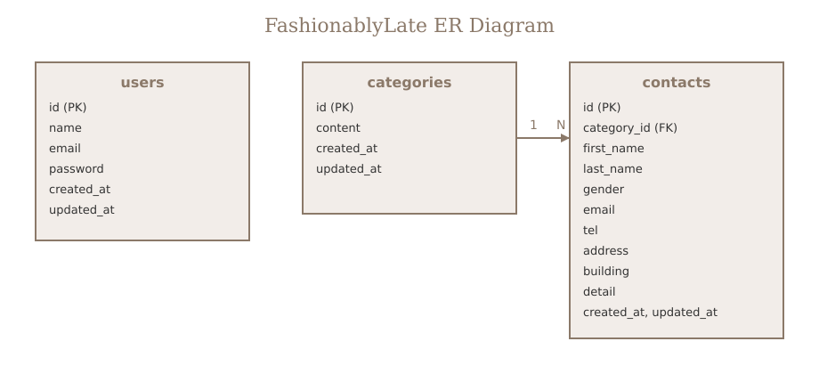

# FashionablyLate

お問い合わせフォームと管理画面を備えた Laravel 8 確認テスト用アプリケーションです。

## 環境構築

リポジトリを clone したあと、以下の手順で環境を構築してください。

```bash
git clone git@github.com:kota-sudo/fashionably-late.git
cd fashionably-late
docker compose up -d --build
docker compose exec php bash
```

コンテナ内（`/var/www` = ホストの `src/`）で以下を実行します。

```bash
composer install
cp .env.example .env
php artisan key:generate
php artisan migrate:fresh --seed
```

コンテナから抜ける場合は `exit` を実行してください。

### 補足

- Laravel アプリケーションは `src/` 配下に配置されています
- Docker Compose 起動後、PHP コンテナ内で artisan / composer コマンドを実行します
- `.env` は `src/.env.example` をコピーして作成します（Docker 用 DB 設定済み）

## 使用技術

- PHP 8.1
- Laravel 8.x
- MySQL 8.0
- nginx
- Docker / Docker Compose
- Laravel Fortify

## URL

| 画面 | URL |
|---|---|
| お問い合わせ入力 | http://localhost:8000/ |
| 会員登録 | http://localhost:8000/register |
| ログイン | http://localhost:8000/login |
| 管理画面 | http://localhost:8000/admin |

## ER図



## テーブル設計

### users（認証用）

| カラム名 | 型 | 備考 |
|---|---|---|
| id | bigint unsigned | PK |
| name | varchar(255) | |
| email | varchar(255) | unique |
| password | varchar(255) | |
| created_at | timestamp | nullable |
| updated_at | timestamp | nullable |

### categories（お問い合わせ種類）

| カラム名 | 型 | 備考 |
|---|---|---|
| id | bigint unsigned | PK |
| content | varchar(255) | |
| created_at | timestamp | nullable |
| updated_at | timestamp | nullable |

### contacts（お問い合わせ）

| カラム名 | 型 | 備考 |
|---|---|---|
| id | bigint unsigned | PK |
| category_id | bigint unsigned | FK → categories.id |
| first_name | varchar(255) | |
| last_name | varchar(255) | |
| gender | tinyint | 1:男性 / 2:女性 / 3:その他 |
| email | varchar(255) | |
| tel | varchar(255) | |
| address | varchar(255) | |
| building | varchar(255) | nullable |
| detail | text | |
| created_at | timestamp | nullable |
| updated_at | timestamp | nullable |

### リレーション

- `categories` 1 : N `contacts`（`contacts.category_id` → `categories.id`）
- `users` は認証用で、他テーブルとのリレーションはありません

## 主な機能

- お問い合わせ入力 → 確認 → 保存 → サンクスページ
- Fortify による会員登録・ログイン・ログアウト
- 管理画面（一覧 / 検索 / 詳細モーダル / 削除 / CSV エクスポート）
